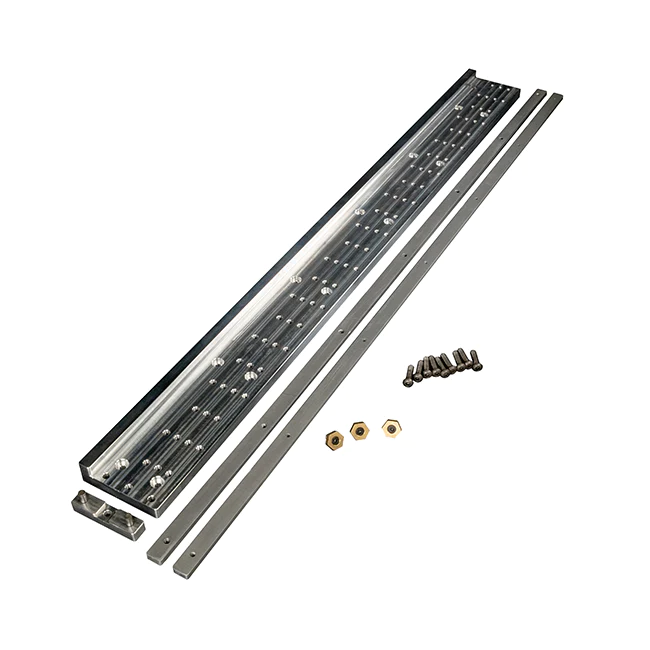
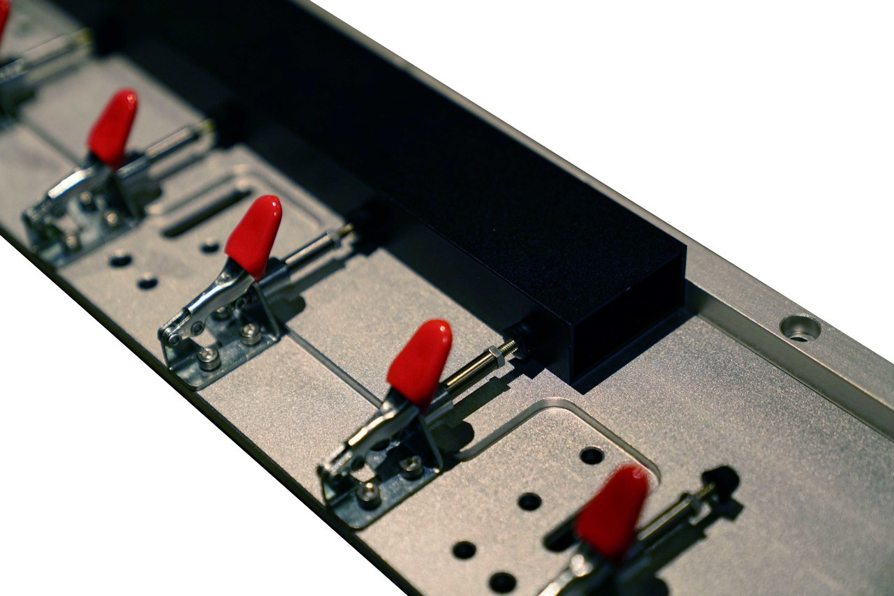
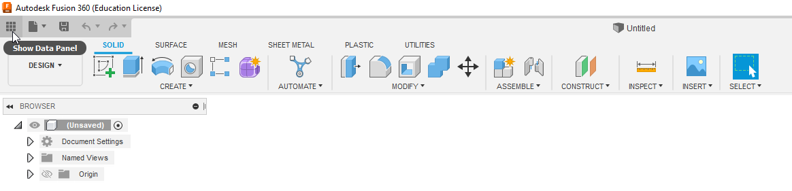
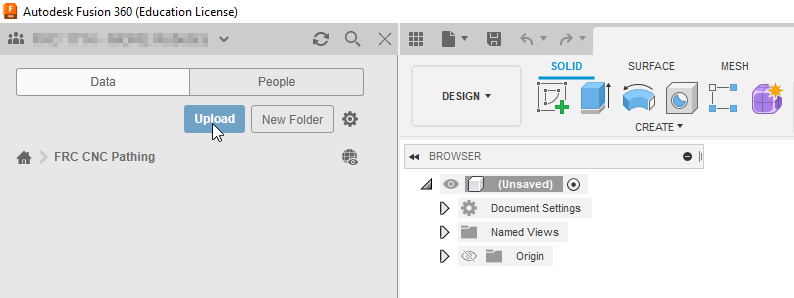
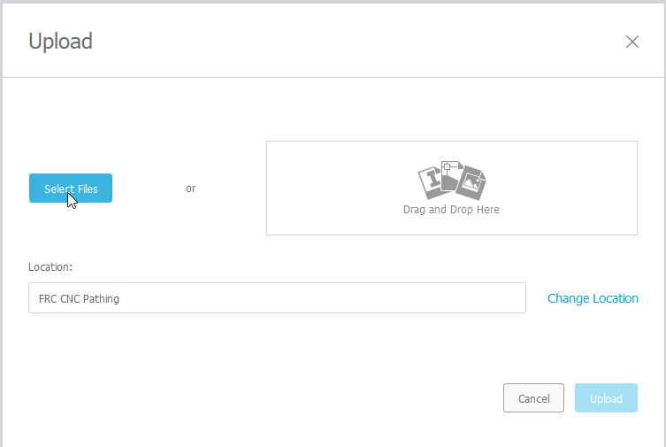

Part Layout
=============

To manufacture a part or several parts in a single operation it is highly helpful to represent the parts virtually how they are going to be manufactured.  This may include the :term:`Work Holding` such as any :term:`Fixtures <Fixture>` that may need machined features to retain the part or are at potential risk of collision and/or other parts that are to be manufactured in the same operation.

Examples:
~~~~~~~~~~~~

The following are examples of what is helpful to include (or not in your part layout).

Fixture Plate
-------------------

Including and working off of a common fixture plate can be very useful to reference existing geometry and changes made to it. 

On `FRC 930 <httpe://team930.com/>`_, a common sacrificial fixture plate of 1" thick aluminum was used to attach plate parts to.  More details on this method can be found at :doc:`/CNC Manufacturing/Haas`.

Tube Fixturing
-------------------

The `WCP OMIO CNC Tube Fixture <https://wcproducts.com/products/omio-cnc-and-accessories>`_, is is a workholding solution designed for standard FRC tubing and the OMIO CNC router.

The `Tube Magic <https://ozzyboards.com/tubemagic/>`_ system is similar and is utilized by FRC 1714.  However, these clamps are not as rigid as the fixturing nuts utilized by the WCP version.

Due to the clamps being well below and offset from the tool, it is not usually helpful to include it, unless the operation goes particularly deep into the part (see :doc:`/CNC Manufacturing/OMIO`).

Part Nesting
~~~~~~~~~~~~~~~~~~~~~~~

Part :term:`Nesting` is the fitting  of parts 

Considerations
+++++++++++++++++++++++++++

:term:`Nesting` in FRC is typically done manually, due to the small scale production of parts and varied methods of :term:`Work Holding`.  Howver, nesting can be a very useful process to limit tool changes and workholding setups and save material.

When nesting your parts for batch production, keep in mind the following considerations:

* Ensure there is sufficient gap between your parts for the endmill fit between your parts.  For better finish, ensure this distance is minimally the endmill diameter + 2x the finishing pass depth.
* Consider how each finished part and bit of excess material will be held in place as they are being cut.
* Try to consider if it is more efficient to spread the parts into seperate operations, or do them individually.  Doing batch operations at scale can save a lot of time, but if something goes wrong (see :doc:`Common Issues`), you might end up with a lot of unusable partially finished parts.

.. todo:: 
    Add images for explaination

To begin parts must be created or imported from a :term:`CAD` software and imported into Fusion 360.  If you are using a native Fusion 360 part, skip to :ref:`FRC Best Practices`, otherwise continue to :ref:`importing files into fusion 360`. 

Importing Files into Fusion 360
++++++++++++++++++++++++++++++++++++

For importing a file from a Autodesk software, native parts should be easily opened by Fusion 360.  If a part is created in any other software, the ``.STP`` or ``.STEP`` file format is recommended.  

To import a part, first select "Show Data Panel" in the upper left hand of the screen.

Then the blue "Upload" button

Then "Select Files" to open a file explorer window to select your ``.STP`` or ``.STEP`` file to upload.  

