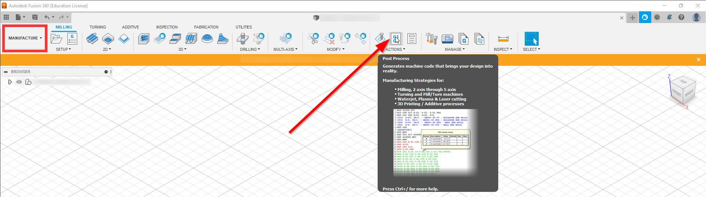
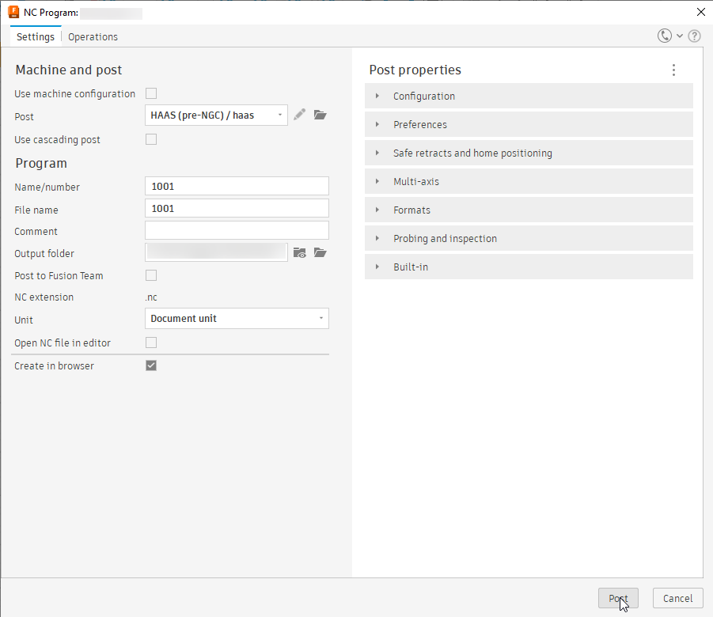

Post-Processing
=====================
**Post-Processing** is the process of compiling and connecting the :term:`paths <Path>` together by a :term:`CAM` software so that it can be read by the CNC machine.  While this process is largely similar for different :term:`CNC` machines, there are some differences in the way that the :term:`gcode` is compiled and options that need to be configured for a given machine.

However, once this configuration is configured the first time, there is usually very little need to make any modifications going forward, unless a different machine is being used.  See :ref:`post-processing profiles` for preconfigured settings for :ref:`Haas <haas post-processing>` and :ref:`OMIO <omio post-processing>` CNC machines.

Post-Processing Process
++++++++++++++++++++++++++++++++

The proccess of post-processing in Fusion 360 is very simple.

#. In the Manufacture Workspace, under actions just select the Post-Processing menu.

2. This will open the Post-Processing Menu, from which a variety of settings can be selected.

These settings include:

.. todo::
    Make table of options and definitions

3. Click ``Post`` in the bottom right and it will save the file to the specified location/

.. todo:: 
    Show successful, error and failed post-processing

Selection Options:
~~~~~~~~~~~~~~~~~~~~~~~~~~

By default, with no selection Fusion 360 will export all valid paths in the current document.  To make a specific selection, see the below options: 

Specific Setups
-------------------------

To export a specific setup or setups, select them before selecting post-process or right click on the selection and select post-process from the dropdown menu.  

.. todo::
    add image

Specific Paths
--------------------

To export a specific path, just like exporting a setup, select them before selecting post-process or right click on the selection and select post-process from the dropdown menu.  

.. todo::
    add image

Post-Processing Profiles
+++++++++++++++++++++++++

Haas Post-Processing
~~~~~~~~~~~~~~~~~~~~~~~~~~~~~~~

OMIO Post-Processing
~~~~~~~~~~~~~~~~~~~~~~~~~~~~