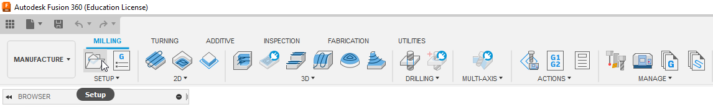
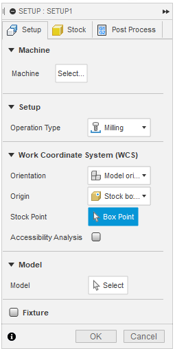
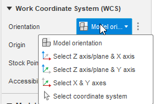

Setup
==========================

The setup process provides information to the :term:`CAM` software about how large and the orientation of the :term:`Stock` material that the parts are going to be made from and the orientation/location of the machine :term:`Origin` relative to that stock.

*The primary goal of the Setup process is to make the setup in* :term:`CAM` *be an identical, but virtual representation of the setup of the physical CNC for an operation.*

Critical aspects
+++++++++++++++++++++++
 
.. todo:: 
    Finish Critical Aspects

Origin
~~~~~~~~~~~~~~~~~~~~~

Determine the location of where the part(s) are made relative to the :term:`Origin``

Axes
~~~~~~~~~~~~~~~

Stock Size
~~~~~~~~~~~~~~~~~~~~~~~~~~~~
Can be used to determine nessisary stock size

Creating a Setup in Fusion 360
++++++++++++++++++++++++++++++++

Once you have your parts layed out how you want them to be manufactured, switch to the "Manufacture" tab in the upper right hand portion of Fusion 360.

Then, next to manufacture, select the "Setup" icon directly to the right of the "Manufacture" tab. 

Opening the setup menu will open a floating tab typically on the left side of the screen under the view cube as seen below.

This first tab, the "Setup" Tab, deals with configuring the type of gcode to be generated, and outlines how the part is oriented in the :term:`CNC` machine.  Within this tab, the following information can be provided:

* **Machine** - In this section, the machine you are utilizing for the operations can be added

.. note::
    This is not typically nessisary, unless the machine you are using has unique geometry that needs to be avoided.

* **Setup** - This section deals with the Operation type, which this documentation is only covering milling operations, although it is possible to use this to create gcode for Turning, Cutting or Additive operations.

* **Work Coordinate System (WCS)** - This section is used to inform the :term:`CAM` software about how the part is oriented relative to the machine.
    
   * **Orientation** - This determines the orientation method used.
     
     * **Model Orientation** (default) - This is dependant on the way the part was designed, and the desired machining orientation of the part.  As such, you should **always** check that the axes are aligned correctly if using this option.
         * **Select Z axis/plane & X Axis**
         * **Select Z axis/plane & Y axis**

.. warning:: 
    It is critical to get the orientation and directions of the axes correct, and also to make the origin in the :term:`CAM` software the same as what is on the :term:`CNC` when the part is manufactured.

