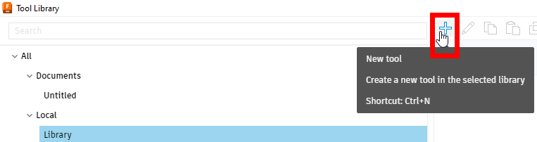
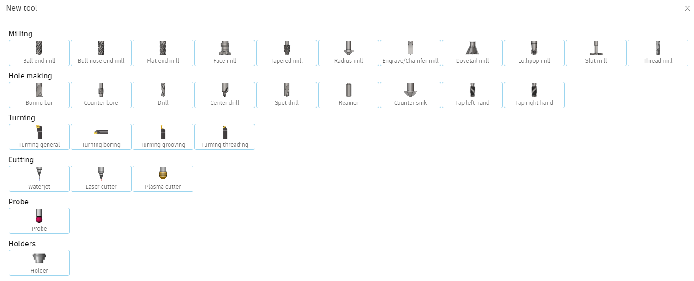
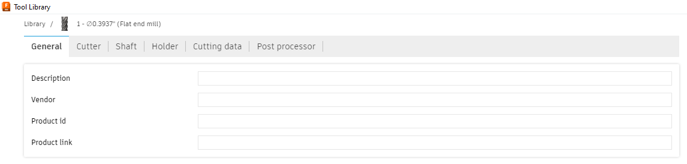
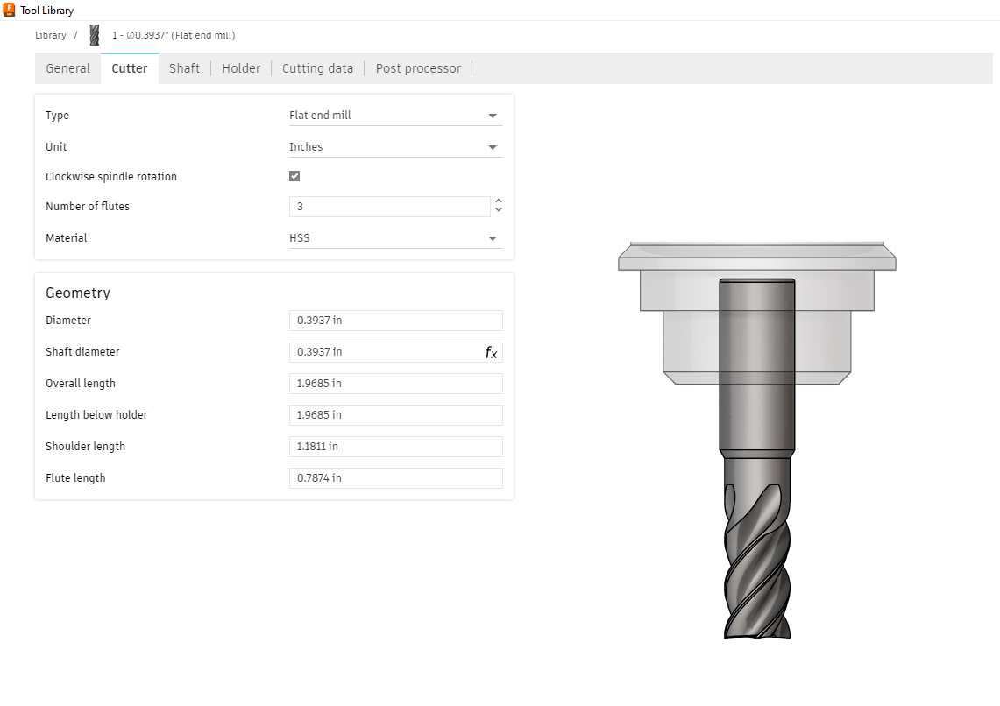
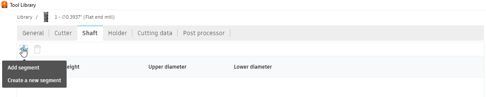
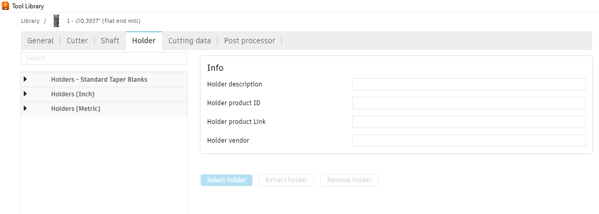
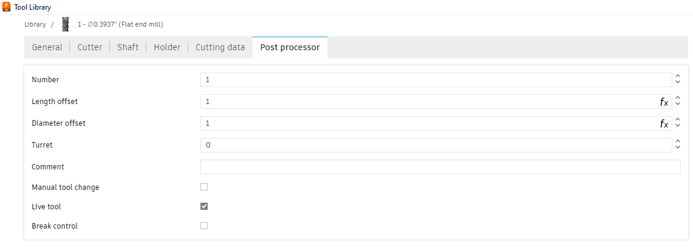

Creating a Tool
==================

Creating a tool can be a complex process that takes a lot of configuration, as such it is reccomended to build off of prexisting tool libraries for your application using the default or precompiled tool libraries provided in :doc:`/Getting Started/Tool Libraries/Tool Libraries`.  However, there may be applications for which that a tool is not in your library or is not configured for your machine.

If you simply need a different profile for an existing tool (ex: different material or different settings for an operation like finishing) look into just adding a new configuration (see :ref:`modifying tools`).  

Creating a New Tool
+++++++++++++++++++++++++++++++

In general, if a tool or profile has a chance of being useful in a future application, it is more useful to have it in a tool library rather than just the document.  To add this tool to a library vs to the document, the only difference will be if the new tool is added to the Document Specific Tools or the Local Tool Library section.

To create a tool select the desired library and document and the new tool button or ``Ctrl + N``.

Then in the following menu there are many different tool profiles to choose from.  

For this example, the "Flat end mill" option will be used.  Some other profiles have some different settings to configure, but these are very operation/machine specific and the general process is similar.  After making a selection, a new window will open.  

Tool Configuration
~~~~~~~~~~~~~~~~~~~~~~~~~~~~~~

General 
--------------------

In the **General** tab, the name of the tool can go in the description along with sourcing information if desired.

Cutter
-----------------

In the **Cutter** Tab, the specifications of the physical tool are outlined, including the profile of tool (see :ref:`endmill profiles`), the number of :term:`flutes<flute>`, and the diameter and lengths of the tool (see :ref:`components of an endmill`). 

Shaft 
-------------------------

The **Shaft** Tab is not often nessisary to use, but if the tool/holder has protrusions that are close hitting something, this can be a useful tool in :doc:`/CAM Preparation/Simulation/Simulation`.  However, in most FRC cases this tab is not utilized and this degree of accuracy is unessisary.

Holder
------------------
Similarly, the **Holder** Tab specifies the geometry of the holder for the tool.  One again, this commonly is unessisary to configure in most cases, unless there is warranted concern for a collision.  In these situations, the tool holder geometry can be imported.

Cutting Data
--------------------

The **Cutting Data** Tab...

.. todo:: 
    Cutting Data Tab

Post Processor
--------------------

The **Post Processor** Tab is primarily used for machines with an :term:`ATC`, where the index of the tool matters.  This can be adjusted by changing the ``Number`` selection to match the ATC index.   

Modifying tools
++++++++++++++++++++++++++++

.. todo:: 
    Modifying tools