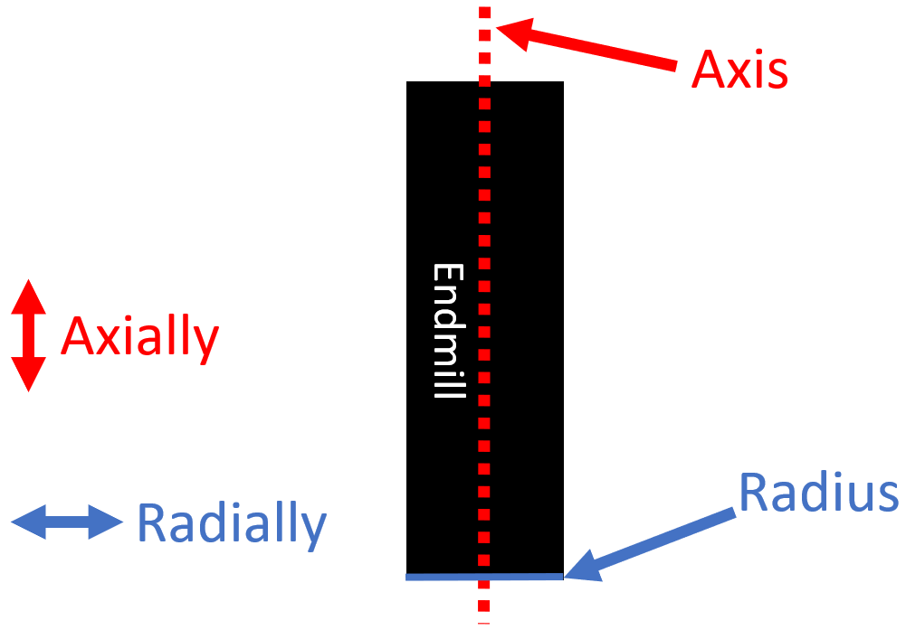
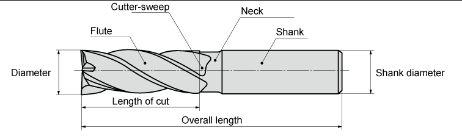
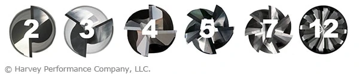
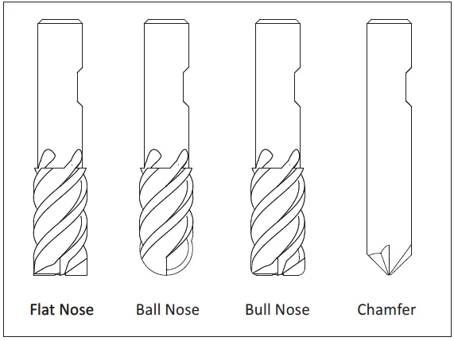
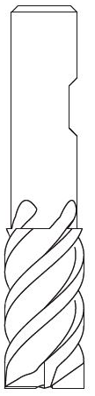
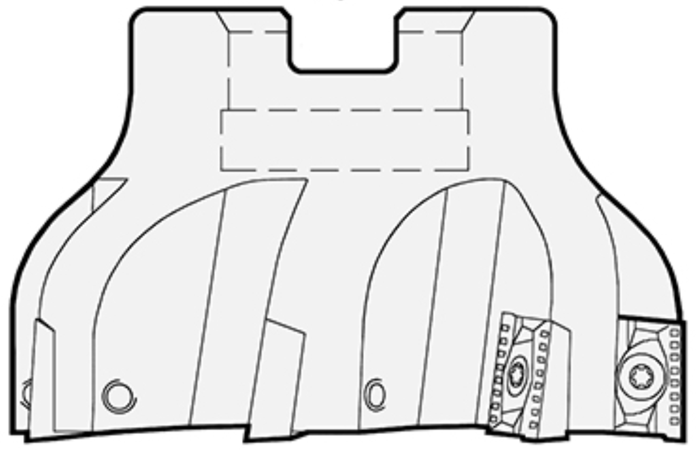
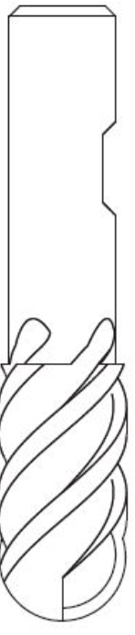
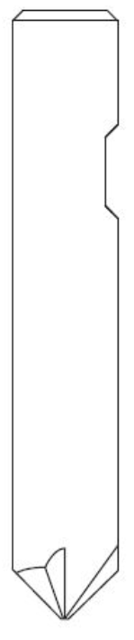
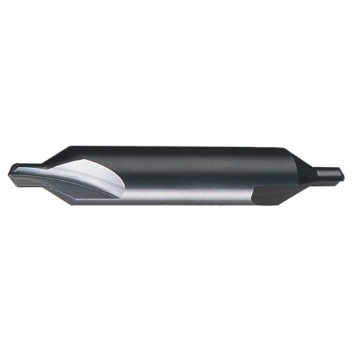
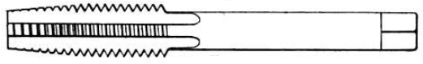

Intro to Endmills
========================

There are many cutters that can be used in :term:`Subtractive Manufacturing` that have different use cases.  THe most common of these cutters used are classified as :term:`Endmills <Endmill>` . 

Endmills
++++++++++++++++++
An :term:`Endmill` is a cutter that can cut along its axis as well as its radius.

Components of an Endmill
~~~~~~~~~~~~~~~~~~~~~~~~~~~~~~~~~~

There are several key imortant aspects of an endmill depending on the application which can be observed in the following diagram:

* **Diameter**:  The diameter determines the minimum internal radius that the endmill can cut and has significant impact over how much material can be removed at a time.
* **Length**:  There are several components to the length of an endmill, but in general, the length of an endmill determines tha maximum depth of cut that is possible.  Typically, minimizing this length is desired, as this increases the range of the machine in the :term:`Z` axis and reduces :term:`Chatter`
* **Flutes**:  A :term:`Flute` is a cutting channels in an endmill that forms and evacuates chips from the tool.  There can be many different numbers of flutes depending on the application.  In general, a higher flute count results in a faster :term:`Feedrate`, a better surface finish and a stronger tool, but a smaller cutting rate and more vibration (see :term:`Chatter`) than an endmill with a lower number of flutes.  Typically for :term:`Routers`, 1-flute endmills are used due to their faster :term:`Spindle`, and 2-5 flute endmills are used in most CNC mills however higher and variable flute count endmills exist (see below).

Endmill Profiles
~~~~~~~~~~~~~~~~~~~~~~

There are many variations of endmill geometries that are used to cut different profiles.  

Flat
-----------

Flat endmills are the most common endmill type and are cylindrically shaped.  This profile allows for square corners and flat surfaces to be machined. 

Face
---------

Face endmills are used to machine large areas into a flat surface.

Ball
-----------------

Ball endmills have a distinctive rounded end at the bottom of the tool that form rounded or fileted profiles.

Chamfer
------------------------
Chamfer endmills can create chamfered profiles and are often used to deburr parts or countersink holes.  

Non-Endmills
+++++++++++++++++++

These other cutters differ from endmills in that they are not intended to cut along their radius. 

Drill bits
------------

Drill bits are used to make holes.  Drill bits are prone to :term:`Walking`.

.. image:: Images/DrillBit.jpg
    :alt: Drill Bit

Spot Drills
----------------
Spot drills or center drills are designed to be able to precisely locate where drill bits go and can also be used to chamfer holes.  Unlike drill bits, these spot drills do not have the issue of :term:`Walking` and are used to create a indentation that guides the drill bit.

Tap
-----------

A tap is used to create threads inside of a hole.  To do so, very controlled and coordinated motion is required by both the rotation of the spindle and the motion of the :term:`CNC`.  As such, typically :term:`Routers` can not perform tapping operations. 

