Prerequisites
=================

CAD Software
++++++++++++++++++
To create the geometries to manufacture, a :term:`CAD` software is required.  There are many different softwares that can be used, depending on preference.  If you do not have a software that you are confortable with already, `Onshape <https://www.onshape.com/en/>`_ is good selection to begin with with their `tutorial suite <https://learn.onshape.com/collections/onshape-fundamentals-cad>`_ and browser-based cloud approach to :term:`CAD`.

Regardless of which :term:`CAD` software used, the part to manufacture will need to be exported as a generic solid body file, such as ``.STEP`` or ``.STP`` file that can be imported into the :term:`CAM` software.  

CAM Software
++++++++++++++++++++
Instead of creating a :term:`CNC` :term:`path` manually to create the instructions to create these geometries, line-by-line (TODO:ADD EXAMPLE), there are :term:`CAM` softwares that have been developed that generate this :term:`gcode` for us.  This is much more reliable, faster and allows us to simulate what the machine will be doing virtually before running the actual program on the machine, and finding out we made a small error somewhere in the typically thousands of lines of code.  This also allows us to easily take operations from similar parts, and apply the same settings (same tool, same path type, ect...) and simply reselect the new geometry--making it much easier to produce parts and quickly make changes.  

This documentation will be using Autodesk Fusion 360, as it is a free program (with an educational licence), does not require installation of a large program, and has some cloud and collaboration capabilities.  If you do not already have an educational account, follow the following instructions otherwise jump to :ref:`Installing Fusion 360`.

Create an Autodesk Account
-----------------------------------

.. image:: Images/Fusion360Logo.webp
  :alt: Autodesk Fusion 360 Logo

If you do not already have an Autodesk Account, you can create one on `Autodesk's website <https://www.autodesk.com/education/edu-software/>`_ by clicking the black "Get Started".  Otherwise if you already have an Autodesk Account skip to :ref:`Installing Fusion 360`.

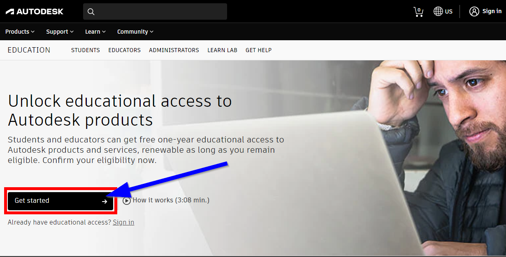

Then select "Create Account"

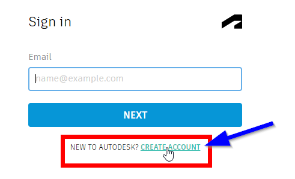

Fill out your information and verify your email:

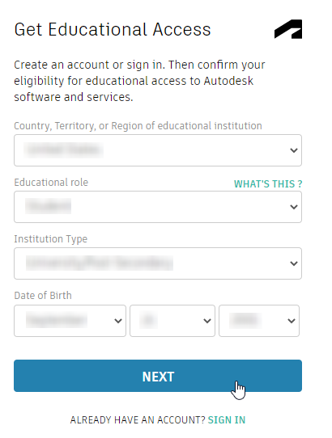
  
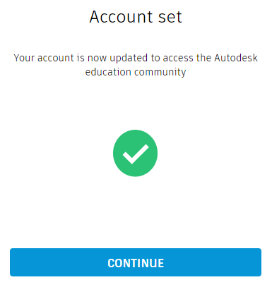

Then, log in to your account and return to `Autodesk's Educational page <https://www.autodesk.com/education/edu-software/>`_.  You will likely need to provide more information to verify your account.

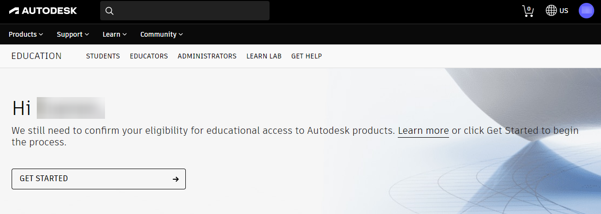

Once you verify your information you should see this confirmation:

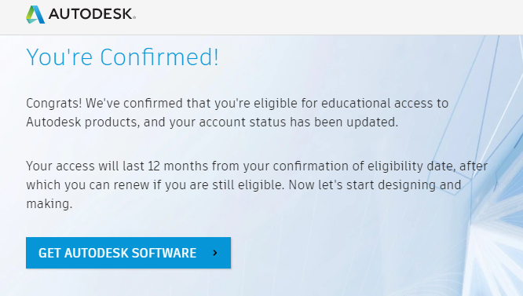

Congratulations! You now have a Autodesk Educational Account!

Installing Fusion 360
-------------------------------

Now that you have an Autodesk Account it is now time to install Autodesk Fusion 360 (if you already have it installed, jump to :ref:`Join a Fusion Team`).  

To install Fusion 360, ensure that you are logged into your Autodesk Account, and then go to the `Autodesk EDU Products homepage <https://www.autodesk.com/education/edu-software/>` and select "Get Product" (see below).

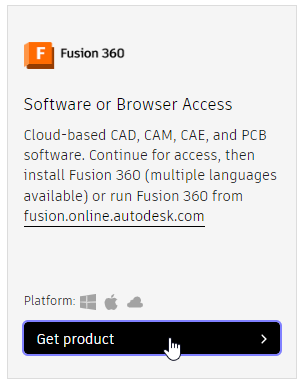
  
  
.. note:: 
  If you see "Get Started" instead of "Get Product" as shown below, this means you are not signed in or do not have an educational account.  Click on "Get Started" and sign in if directed, otherwise follow the process in ::ref:`Create an Autodesk Account`.  

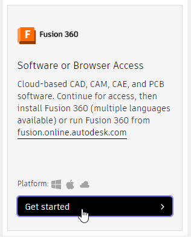

Select "Access" to download the Autodesk Fustion 360 installer.

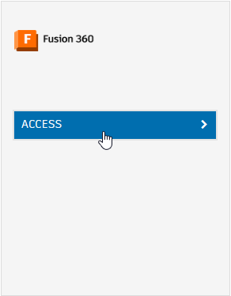

After the download is completed, run the installer (Fusion 360 Client Downloader) and follow the prompts to complete the installation.  Once the program opens you will have to login to your Autodesk account once again.

Join a Fusion Team
-----------------------------
To facilitate collaboration, Fusion 360 has the option to join teams to easily share files between users.  

To configure a new team, follow the instructions `here <https://knowledge.autodesk.com/support/fusion-360/troubleshooting/caas/sfdcarticles/sfdcarticles/How-to-signup-for-a-new-Fusion-team-hub.html>`_.  

If there is a team that you are joining, follow the following steps:

#. Open the Data Panel in the upper left hand corner:

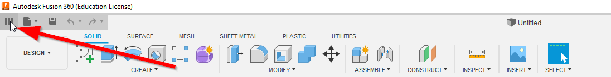

#. Select the Team Account icon:

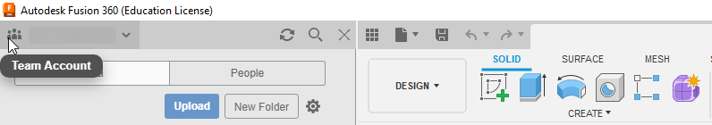

#. Select Create or Join Team:

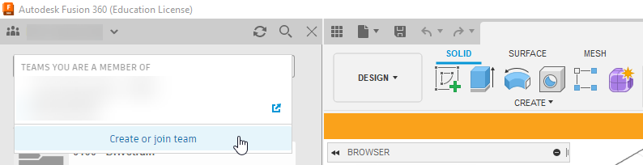

#. If your email has been invited to a team, select the team to be added to the workspace.

