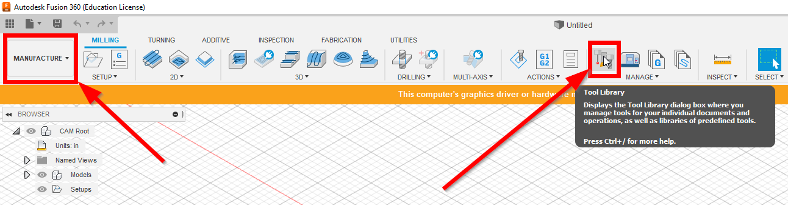
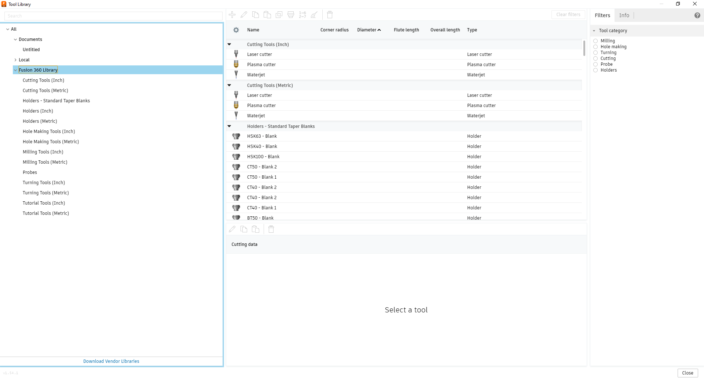
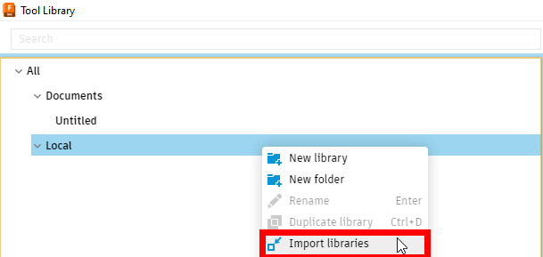

Tool Libraries
=========================

Tool Libraries are collections of tools that with preconfigured settings for a variety of tools.  Fusion 360 has some default example tools 

To access the Tool Libraries avalible in Fusion 360 in the Manufacture Workspace (note the selection of "Manufacture" in the upper left of the below image), select the Tool Library icon.

From this, the Tool Library window will open with Document Specific, Local and Fusion 360 Libraries.

* **Document Specific**: These libraries are temporary and consist of all the tools used within that particular document.  These can be copies from any other library or custom to that document, however any modifications or new tools created remain only with that document.
* **Local**: Local Libraries are libraries that you create or import.
* **Fusion 360 Libraries**: Fusion 360 Libraries are example tools that can accelerate getting settings that work for a particular tool and material.

Precompiled Tool Libraries
++++++++++++++++++++++++++++++

Precompiled tool libraries are avalible here and can be imported into your Local Libraries using the following steps in :ref:`import a library`.

Hass Tool Library
-----------------

TODO

OMIO Tool Library
---------------------

The OMIO is used by FRC 1714 and the following library has been complied from their tuning:

:download:`OMIO Tool Library V1.1 <../Tool Libraries/Libraries/MORE Tool Library V1.1.tools>`

Import a Library 
+++++++++++++++++++++++
To import a tool library into your Local Libraries open the "Tool Library" window as shown in :ref:`tool libraries`.  Then **right click** on the "Local" heading and select "Import a Library".

A File Explorer window will pop up and a ``.tools`` tool library can be selected and imported such as the precompiled ones in :ref:`precompiled tool libraries`.

